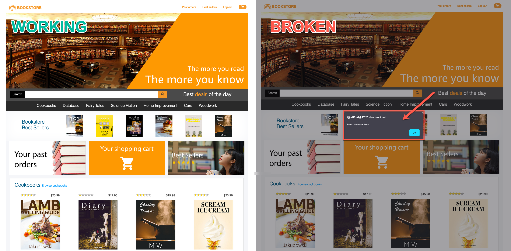
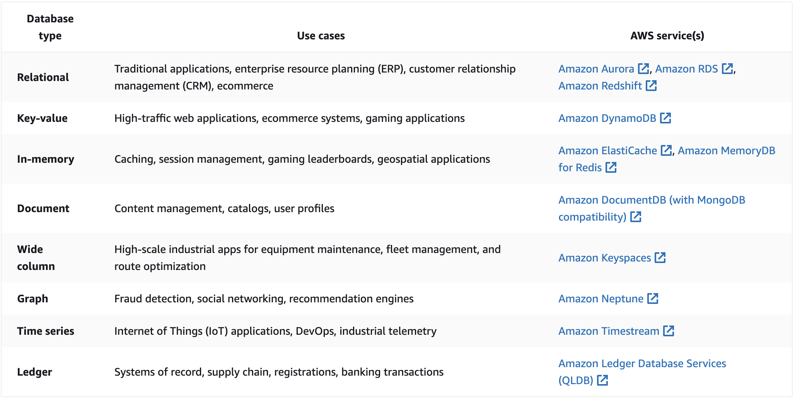
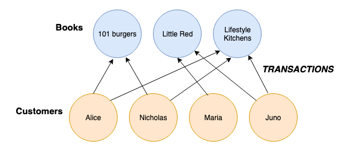
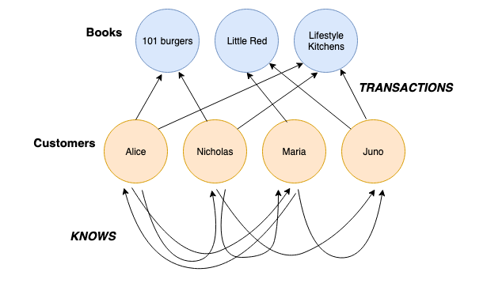
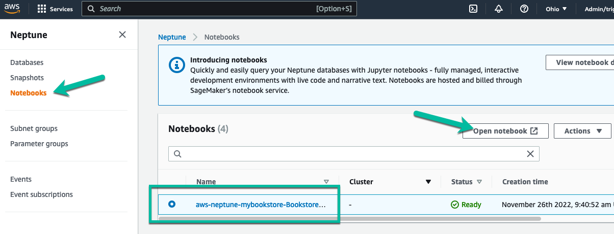

# DAT401: Build a web-scale applications with pupose-built databases and analytics

In this workshop, learn to build modern web applications at scale using purpose-built databases. Discover how to apply development patterns using Amazon DynamoDB, Amazon ElastiCache, Amazon Neptune, and Amazon OpenSearch Service to build a fully functional and scalable bookstore ecommerce application and dive deep into best practices along the way. Basic familiarity with AWS concepts and services such as IAM, VPC, networking, and storage services is recommended.

You will start this workshop using the fully-functioning version of the Bookstore App. At the end of Module 1, we will walk you through how to gain access to the AWS account and the dedicated deployment of the Bookstore App that you will be using.




## Introduction to purpose-built databases

Databases play a huge role in the application modernization journey, and AWS offers 15+ purpose-built engines to support diverse data models, including relational, key-value, document, in-memory, graph, time series, wide column, and ledger databases which empower you to build use case-driven, highly scalable, distributed applications suited to your specific needs.



## Workshop Overview

The goal of the AWS Bookstore Demo App is to provide a fully-functional web application that utilizes multiple purpose-built AWS databases and native AWS components like Amazon API Gateway and AWS CodePipeline. Increasingly, modern web apps are built using a multitude of different databases. Developers break their large applications into individual components and select the best database for each job.

Let's consider the AWS Bookstore Demo App as an example. The app contains multiple experiences such a shopping cart, product search, recommendations, and a top sellers list. For each of these use cases, the app makes use of a purpose-built database so the developer never has to compromise on functionality, performance, or scale.


### Database components

Product catalog/shopping cart: Amazon DynamoDB offers fast, predictable performance for the key-value lookups needed in the product catalog, as well as the shopping cart and order history. In this implementation, we have unique identifiers, titles, descriptions, quantities, locations, and price.
Search: Amazon OpenSearch Service enables full-text search for our storefront, enabling users to find products based on a variety of terms including author, title, and category.
Recommendations: Amazon Neptune provides social recommendations based on what user's friends have purchased, scaling as the storefront grows with more products, pages, and users.
Top sellers list: Amazon ElastiCache for Redis reads order information from Amazon DynamoDB Streams, creating a leaderboard of the “Top 20” purchased or rated books.

### Application components

Serverless service backend: Amazon API Gateway powers the interface layer between the frontend and backend, and invokes serverless compute with AWS Lambda.

Web application blueprint: We include a React web application pre-integrated out-of-the-box with tools such as React Bootstrap, Redux, React Router, internationalization, and more.

### Infrastructure components

Continuous deployment code pipeline: AWS CodePipeline and AWS CodeBuild help you build, test, and release your application code.

Serverless web application: Amazon CloudFront and Amazon S3 provide a globally-distributed application.


## Architecture

Below are the high-level architechture diagrams detailing the services being used for the AWS Bookstore Demo App. This workshop will cover the interactions between the Bookstore App's frontend and the backend databases and how this is accomplished through a series of APIs and associated AWS Lambda functions.


### Frontend

Build artifacts are stored in a S3 bucket where web application assets are maintained (like book cover photos, web graphics, etc.). Amazon CloudFront caches the frontend content from S3, presenting the application to the user via a CloudFront distribution. The frontend interacts with Amazon Cognito and Amazon API Gateway only. Amazon Cognito is used for all authentication requests, whereas API Gateway (and Lambda) is used for all API calls interacting across DynamoDB, OpenSearch, ElastiCache, and Neptune.

### Backend

The core of the backend infrastructure consists of Amazon Cognito, Amazon DynamoDB, AWS Lambda, and Amazon API Gateway. The application leverages Amazon Cognito for user authentication, and Amazon DynamoDB to store all of the data for books, orders, and the checkout cart. As books and orders are added, Amazon DynamoDB Streams push updates to AWS Lambda functions that update the Amazon OpenSearch cluster and Amazon ElasticCache for Redis cluster. Amazon OpenSearch powers search functionality for books, and Amazon Neptune stores information on a user's social graph and book purchases to power recommendations. Amazon ElasticCache for Redis powers the books leaderboard.


### Developer Tools

The code is hosted in AWS CodeCommit. AWS CodePipeline builds the web application using AWS CodeBuild. After successfully building, CodeBuild copies the build artifacts into a S3 bucket where the web application assets are maintained (like book cover photos, web graphics, etc.). Along with uploading to Amazon S3, CodeBuild invalidates the cache so users always see the latest experience when accessing the storefront through the Amazon CloudFront distribution. AWS CodeCommit. AWS CodePipeline, and AWS CodeBuild are used in the deployment and update processes only, not while the application is in a steady-state of use.


## The Lab

### Implement the DynamoDB GetBook API Call

#### What is DynamoDB?

DynamoDB is a fast, flexible NoSQL database service which provides consistent single-digit millisecond response times at any scale. It provides a key-value API with the ability to group records together by a related key and sort them by one of the attributes in the records. This makes it the perfect datastore for access patterns that have relatively simple lookup requirements like getting a specific book, user, or order record and that is how we use it in the book store app.

#### The Lambda

Update the GetBook lambda to make the call to dynamo DB.

```
  dynamoDb.get(params, (error, data) => {
    // Set response headers to enable CORS (Cross-Origin Resource Sharing)
    const headers = {
      "Access-Control-Allow-Origin": "*",
      "Access-Control-Allow-Credentials" : true
    };

    // Return status code 500 on error
    if (error) {
      const response = {
        statusCode: 500,
        headers: headers,
        body: error
      };
      callback(null, response);
      return;
    }

    // Return status code 200 and the retrieved item on success
    const response = {
      statusCode: 200,
      headers: headers,
      body: JSON.stringify(data.Item)
    };
    callback(null, response);
  });
```

### Implement the Neptune GetRecommendations API Call

A key component to any successful eCommerce application is to provide the user with a set of product recommendations based on their demographics or user behavior (previous purchases). Product recommendations can be calculated using a number of different deterministic and probabalistic techniques. A common method for deriving recommendations is through a graph algorithm called Collaborative Filtering .

Collaborative Filtering can be applied in its simplest form by creating a graph of users and products, each stitched together via edges (or relationships) formed via transactions. In the image below, we have a bipartite graph  demonstrating such a data model.



Using this model, we can derive product recommendations by starting with a given product vertex (maybe a product or book we're currently browsing on the site), traversing to other users that have purchased this product, and then traversing again to other products those users have purchased. We can then group these products by the total number of times they are seen in our series of graph traversals.

```
Example:  Imagine we are on the product page for the "Lifestyle Kitchens" book.  
What additional books might we want to recommend to a user looking to purchase this book?

The "Lifestyle Kitchens" book has the following two-hop relationships associated with it:

<-- Juno --> Little Red
<-- Nicholas --> 101 Burgers
<-- Alice --> 101 Burgers

"101 Burgers" appears twice in the two-hop relationships associated with "Lifestyle Kitchens."  
Maybe we should recommend this book in addition to the one the user is currently browsing.
```

We can also add features and attributes to our graph data model that might improve our recommendations. What if we had each user provide their social media handles with their user profiles upon registering for the site? 

Given that most people are friends with others with common interests, we could presume that recommendations driven by social connections might improve the quality of our recommendations (and potentially our conversion rates).

By including those social relationships, we could have a data model such as the one depicted below.



The data model depicted above is the model that we have chosen to use with the Bookstore Demo App.

```
How might this new data model including friends relationships change the 
outcome of our example above?  For example, let's say it is Maria browsing 
the "Lifestyle Kitchens" book.  What should we recommend, based on Maria's friendships?

Maria knows the following people (and note how the friendship/knows relationships 
can be uni-directionaly, much like a real-world social media relationship):
--> Juno
--> Alice

Along with purchasing "Lifestyle Kitchens", Alice and Juno also purchased 
"101 Burgers" and "Little Red," respectively.  We already know that Maria 
previously purchased "Little Red", so we could then recommend "101 Burgers" 
as a possible addition to Maria's purchase.
```

#### The Neptune Notebook

A lot of graph database users leverage Jupyter notebooks (or a similar notebook environment) when modeling graph data, writing graph queries, or visualizing graph query results. 

With Amazon Neptune, we've developed a set of libraries on top of Jupyter, called the Neptune Workbench , for this very purpose. 

We've deployed a notebook instance for you to use in this workshop. Follow these steps to access it.


1. In the Neptune console, you should see that we have a single Neptune cluster deployed with a single Neptune instance.

2. In the left-hand menu, you will see a menu option called Notebooks. Click on Notebooks. Here you will notice that we have also launched a Neptune Notebook instance for you. Click on the radial button next to the notebook instance. Then click the Open Notebook button to launch the notebook console. This will launch the notebook console in a new browser tab.



##### Module 3: Powering Recommendations Using Amazon Neptune

Amazon Neptune supports three different graph query languages.  In the following exercises, we are going to take a brief look at two of the languages - Apache TinkerPop Gremlin and openCypher.  These exercises barely scratch the surface when it comes to the power of each of these languages.  Our goal here is to briefly show you how each of these languages are structured and give you enough information to form a basic recommendations query.

For further learning, you can leverage the [Amazon Neptune Workbench](https://docs.aws.amazon.com/neptune/latest/userguide/graph-notebooks.html), which ships with many different example notebooks that show you how to use these languages with common graph database use cases.

###### Section 1:  Querying a Graph Database

Let's review the data model that we discussed earlier in this module:


The graph contains two types of nodes (or vertices) and two types of edges.  We can see the total number of each type of vertex and edge using the following queries.  Highlight each cell and click the Play button at the top of the Jupyter console (or click the play button next to the cell) to run the queries.

%%gremlin

g.V().groupCount().by(label)

%%gremlin

g.E().groupCount().by(label)

We used some different naming for our edges.  It is common in graph data modeling to name edges with a verb or an action.  So we used 'purchased' instead of Transaction and 'friendOf' instead of 'Knows'.

Now let's look at a query that is closer to our use case of driving recommendations.  Let's start with a user and find all products that the user's friends have purchased.  Again, this is using Collaborative Filtering, as we previously mentioned.  The query languages provide a unique way of tranversing the relationships by "hopping" across the 'friendOf' and 'purchased' edges. 

For the purpose of this workshop, we're going to assume that you have a user ID of 'us-east-1:09048fa7-0587-4963-a17e-593196775c4a'.  We'll use this ID in the following examples:

%%gremlin

g.V().hasLabel('customer').hasId('us-east-1:09048fa7-0587-4963-a17e-593196775c4a').
    out('friendOf').
    out('purchased').
    groupCount().
    order(local).by(values,desc).
    unfold().
    limit(5)

The query above returns the top 5 book IDs ordered by the number of times they were seen as purchases from our friend relationships.

###### Section 2: Visualizing Query Results

Our Bookstore App leverages a graph database to drive recommendations.  That doesn't necessarily require a need for a graph visualization.  However, visualizing query results can come in handy during the development process.  Visualizations provide you with an easier way to grok the structure of a graph and how a query gets applied across a graph data set.  In the following exercises, we are going to briefly examine how to visualize graph query results using the Neptune workbench.

Notice how the query below contains a `path()` step.  Whenever a Gremlin query returns a set of paths, the `%%gremlin` command will generate a graph visualization for those paths.  Run the query below.  Then **click on the Graph tab in the results pane to see the visualization**.

%%gremlin

g.V().hasLabel('customer').hasId('us-east-1:09048fa7-0587-4963-a17e-593196775c4a').
    outE('friendOf').inV().
    outE('purchased').inV().path().by(elementMap())

###### Section 3: Build the recommendations query

Now let's pull this all together.  Going back to our Bookstore App, the books recommendations API requires a response in the following format:

```
[
    {
        "bookId": "2rb37qw5-d93b-11e8-9f8b-f2801f1b9fd1", 
        "purchases": 4, 
        "friendsPurchased": [
            "us-east-1:10f71594-5b56-4f82-bd25-6d02685bb44f", 
            "us-east-1:15c0fb03-59b4-4cb0-ad1d-9aea9e6659e6", 
            "us-east-1:21cc3e5a-da24-460f-896f-7a840faec879", 
            "us-east-1:3f9f20ef-bfa6-448d-b08c-5daf30827a58"]
      },
      ...
]
```

Gremlin has some additional steps that allow us to build a JSON-like output.  We can use the `project()` step to construct this.  The following query below is the full recommendations query that we want to use for our application.

%%gremlin

g.V('us-east-1:09048fa7-0587-4963-a17e-593196775c4a').
    out('friendOf').aggregate('friends').barrier().
    out('purchased').dedup().
    project('bookId','purchases','friendsPurchased').
        by(id()).
        by(in('purchased').where(within('friends')).count()).
        by(in('purchased').where(within('friends')).id().fold()).
    order().by('purchases',desc).
    limit(5).
    toList()

We will use this query within our Lambda function to provide the necessary book recommendations. Before we copy this query into our Lambda function, we will need to make some minor modifications. Gremlin has some keywords that collide with keywords in certain programming languages.  In our case, we're using Python for the Lambda function driving the recommendations API.  The Gremlin-Python library requires us to make the following adjustments:

```
g.V('us-east-1:09048fa7-0587-4963-a17e-593196775c4a').
    out('friendOf').aggregate('friends').barrier().
    out('purchased').dedup().
    project('bookId','purchases','friendsPurchased').
        by(id_()).
        by(in_('purchased').where(P.within('friends')).count()).
        by(in_('purchased').where(P.within('friends')).id_().fold()).
    order().by('purchases',Order.desc).
    limit(5).
    toList()
```

Notice the addition of the `_` after the `in` and `id `keywords. The `within` predicate and `desc` order types have also been preceded by their representative classes.

With this query, go back to the Workshop Studio instructions for the next steps in completing the recommendations implementation.